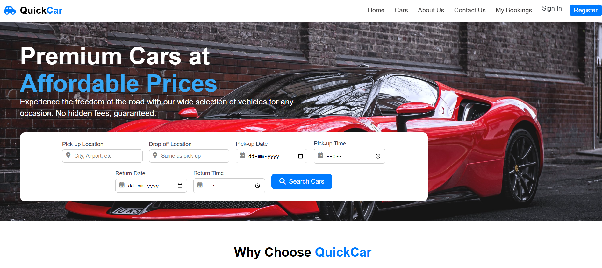
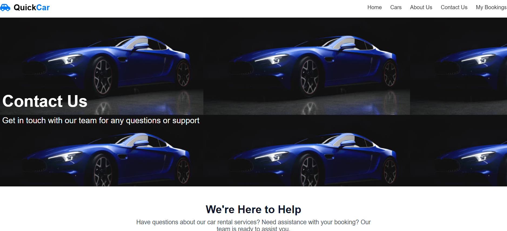
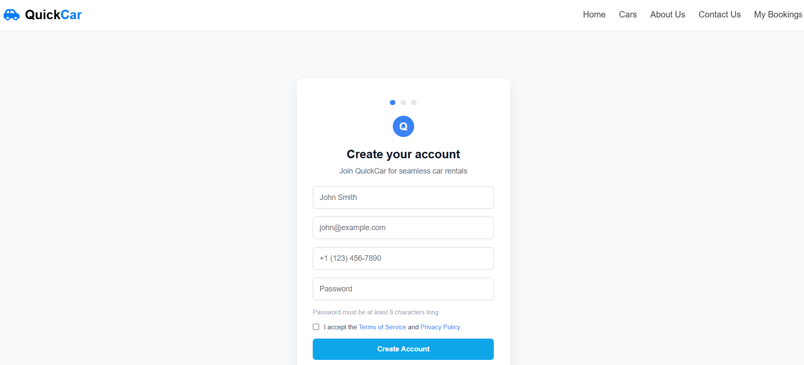
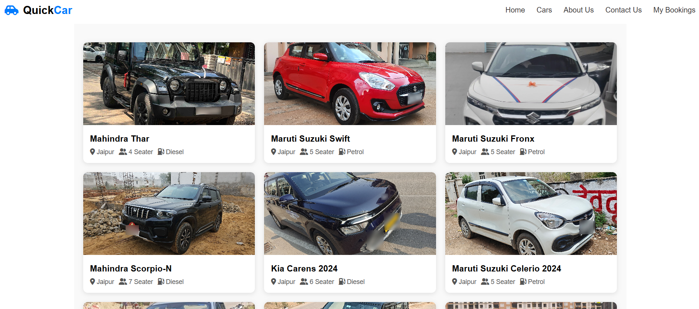
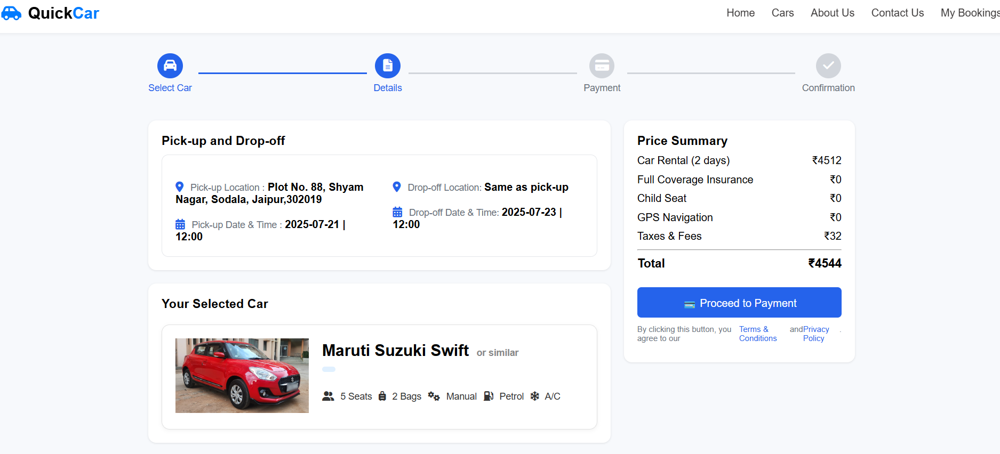
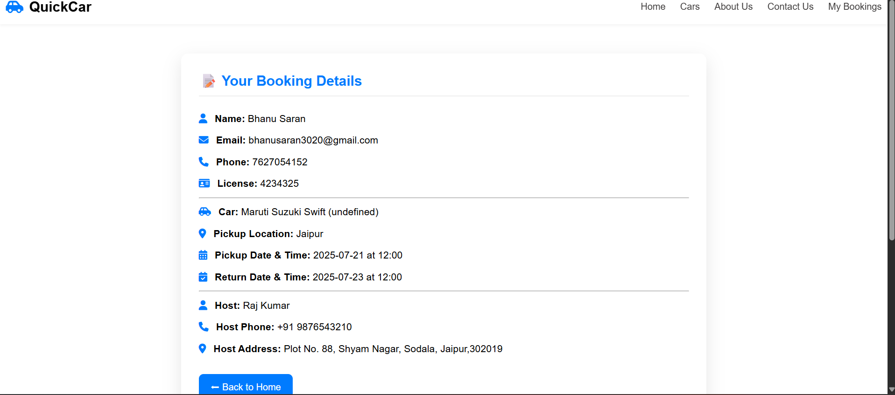

# 🚗 Car Rental – Car Rental Frontend Website

A responsive multi-page **car rental website** built using **HTML, CSS, and JavaScript (Vanilla JS with DOM manipulation)**. This project simulates the frontend of a real-world car rental service with essential pages and dynamic interactions — all managed on the client side using **Local Storage**.

---

## 📺 Live Demo

🌐 [Live Site on Vercel](https://car-rental-bhanu-sarans-projects.vercel.app) 
📁 [GitHub Repository](https://github.com/bhanu-1108/CarRental)

---

## 📸 Screenshots

## 💡 Features

- ✅ Responsive design for desktop and mobile
- ✅ Multi-page site: Home, Sign In, Register, Search Cars, Book Now, My Bookings
- ✅ Booking flow using Local Storage
- ✅ Dynamic DOM manipulation with Vanilla JS
- ✅ QR Code Payment simulation
- ✅ Persistent user sessions (login simulation via Local Storage)
- ✅ Clean and modern UI

---

## 🛠 Technologies Used

| Technology      | Purpose                              |
|------------------|--------------------------------------|
| **HTML5**         | Structure of web pages               |
| **CSS3**          | Styling and layout                   |
| **JavaScript**    | Client-side interactivity            |
| **Vanilla DOM**   | Manual DOM manipulation (no libraries) |
| **Local Storage** | Store user, booking, and car data   |
| **Vercel**        | Hosting and deployment               |

---

